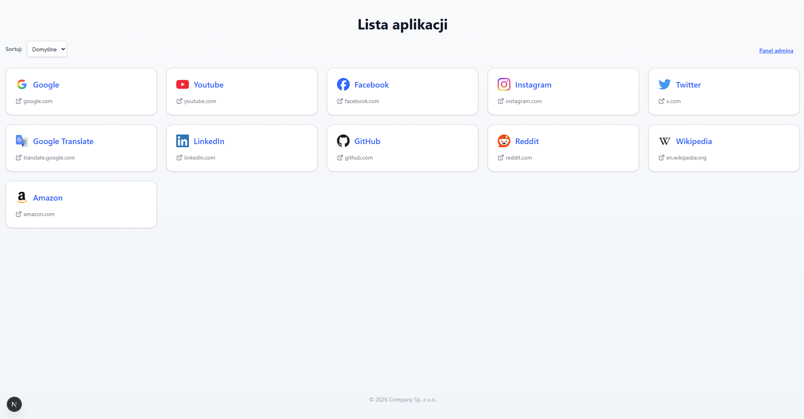
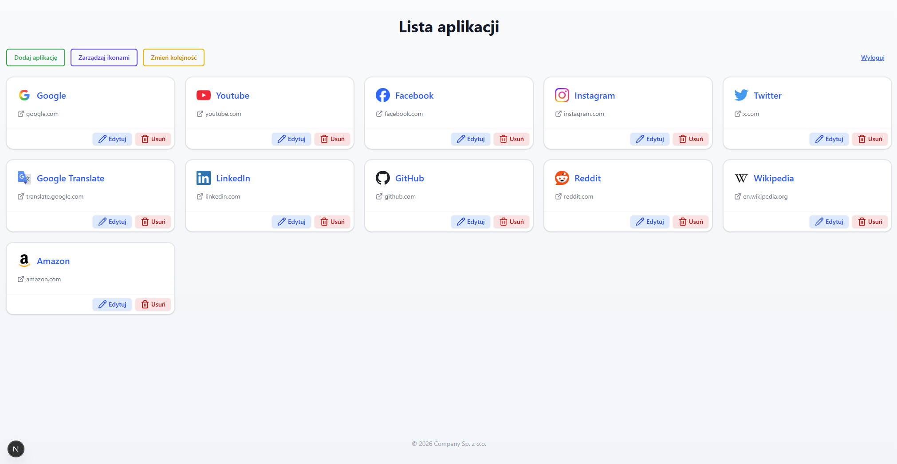
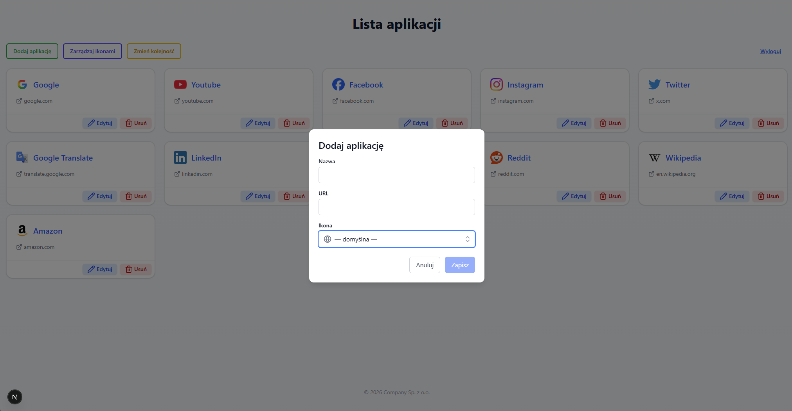
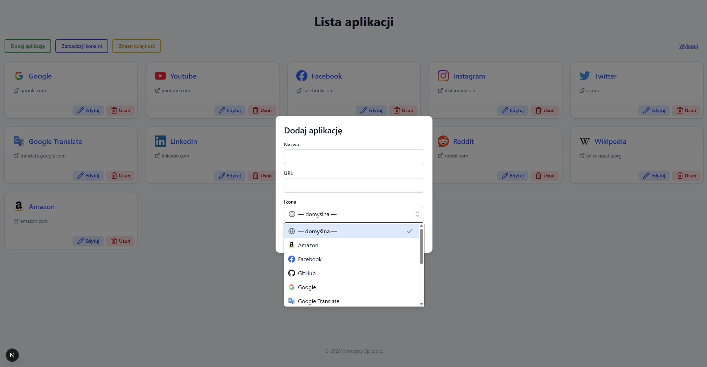
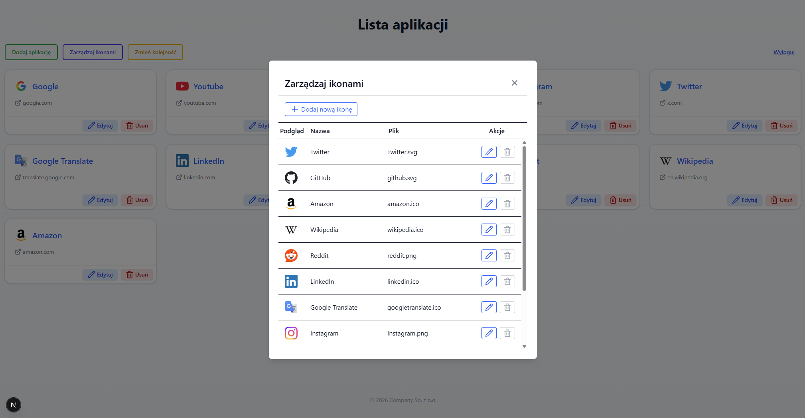
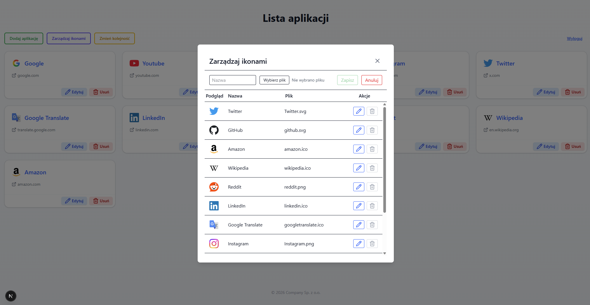
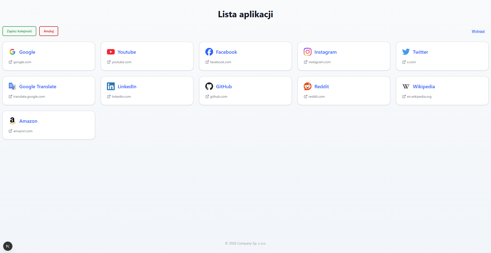

# Application List

A web application for maintaining and displaying a curated list of internal web applications.  
Users can quickly open links, while administrators can manage entries, icons, and ordering.

The system integrates:
- Next.js (App Router)
- Prisma ORM
- SQL Server
- TailwindCSS
- Windows Authentication via IIS headers
- Role-based admin access
- Drag-and-drop reordering
- Icon upload and management

---

## Features

User view:
- Displays a responsive grid of application links
- Sorting options (default order, A–Z, Z–A)
- Automatic icon display
- Opens links in a new tab

Admin panel:
- Add applications
- Edit applications
- Delete applications
- Upload and manage icons
- Drag-and-drop reorder with save/cancel workflow
- Persistent admin mode

System features:
- Prisma caching and tag-based revalidation
- Server-side API routes
- Middleware-based access control
- Windows user detection through IIS headers

---

## Technology Stack

Frontend:
- Next.js
- React
- TailwindCSS
- Headless UI
- Lucide Icons
- DnD Kit

Backend:
- Next.js API routes
- Prisma ORM
- SQL Server

Infrastructure:
- IIS (Windows Authentication header forwarding)
- Node.js runtime

---

## Architecture Overview

Client:
- React components for UI
- Admin controls and modals
- Drag-and-drop reordering

Server:
- API routes for:
  - applications
  - icons
  - authentication
  - user information

Database:
- applications table
- icons table

Storage:
- Icon files stored on disk
- Metadata stored in database

---

## Project Structure

    application_list/
     ├── tsconfig.json
     ├── postcss.config.mjs
     ├── package.json
     ├── package-lock.json
     ├── next.config.ts
     ├── next-env.d.ts
     ├── middleware.ts
     ├── eslint.config.mjs
     ├── .env
     ├── .gitignore
     ├── prisma/
     │    └── schema.prisma
     │
     ├── src/
     │    ├── app/
     │    │    ├── favicon.ico
     │    │    ├── layout.tsx
     │    │    ├── page.tsx
     │    │    └── api/
     │    │         ├── userinfo/
     │    │         │    └── route.ts
     │    │         ├── admin/
     │    │         │    └── me/
     │    │         │         └── route.ts
     │    │         ├── applications/
     │    │         │    ├── route.ts
     │    │         │    ├── reorder/
     │    │         │    │    └── route.ts
     │    │         │    └── [id]/
     │    │         │         └── route.ts
     │    │         ├── icons/
     │    │         │    ├── route.ts
     │    │         │    └── [id]/
     │    │         │         └── route.ts
     │    │         └── icon-files/
     │    │              └── [name]/
     │    │                   └── route.ts
     │    │
     │    ├── components/
     │    │    ├── AdminControls.tsx
     │    │    ├── ClientHome.tsx
     │    │    ├── IconManagerModal.tsx
     │    │    ├── LinkCard.tsx
     │    │    ├── LinkModal.tsx
     │    │    └── SortOptions.tsx
     │    │
     │    ├── hooks/
     │    │    ├── useAdminAccess.ts
     │    │    └── useWindowsUsername.ts
     │    │
     │    ├── lib/
     │    │    ├── adminConfig.ts
     │    │    ├── basePath.ts
     │    │    ├── links.ts
     │    │    ├── prisma.ts
     │    │    └── types.ts
     │    │
     │    └── styles/
     │         └── globals.css
     │
     ├── data/
     │    └── icons/
     │
     └── .next/            (build output)

---

## Database Schema

Tables:

applications
- app_id
- app_title
- app_url
- app_sortOrder
- ico_id
- created timestamp

icons
- ico_id
- ico_name
- ico_fileName
- uploaded timestamp

Relationships:
- One icon can be used by many applications

---

## Configuration

Environment variables (.env):

DATABASE_URL  
Connection string for SQL Server

ADMIN_USERS  
Comma-separated usernames allowed to use admin panel

ADMIN_HEADER_NAME  
HTTP header used to read Windows user identity

NEXT_PUBLIC_BASE_PATH  
Base path when hosted as IIS sub-application

PORT  
Application port

HOST  
Host binding

NODE_ENV  
Environment

Example:

DATABASE_URL="sqlserver://SERVER;database=DB;user=USER;password=PASS"
ADMIN_USERS=user1,user2
NEXT_PUBLIC_BASE_PATH=/ApplicationList

---

## Authentication

The application relies on IIS or reverse proxy to provide a Windows user header.

Flow:
1. IIS authenticates the user.
2. Username is forwarded in a header.
3. Middleware checks if the user is in ADMIN_USERS.
4. Admin API endpoints allow or deny mutations.

In development mode:
- Admin access is automatically allowed if no header is present.

---

## API Endpoints

Applications:
GET /api/applications  
POST /api/applications  
PUT /api/applications/{id}  
DELETE /api/applications/{id}  
PATCH /api/applications/reorder  

Icons:
GET /api/icons  
POST /api/icons  
PUT /api/icons/{id}  
DELETE /api/icons/{id}  
GET /api/icon-files/{name}  

User:
GET /api/userinfo  
GET /api/admin/me  

---

## Running the Project

Install dependencies:

npm install

Generate Prisma client:

npx prisma generate

Run development server:

npm run dev

Open:
http://localhost:3000

---

## Deployment

Typical deployment:
1. Build project  
   npm run build  

2. Start server  
   npm start  

3. Run behind IIS or reverse proxy  
4. Configure environment variables  

---

## Future Improvements

Possible extensions:
- Category grouping
- Search/filter
- Usage analytics
- SSO integration
- REST API token authentication
- Audit logs

---

## Screenshots

